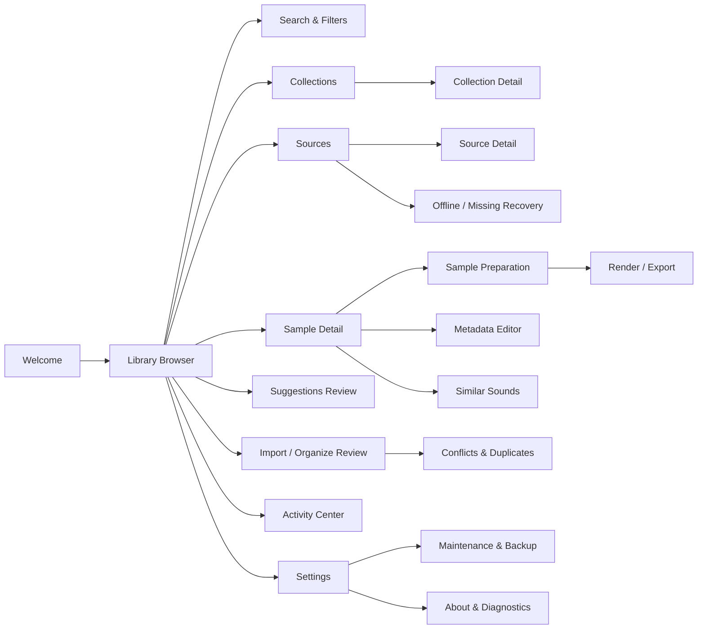

# 14. Navigation and User Flows

## Navigation model

Koffer uses a stable desktop workspace rather than a stack of web-style routes. A user can always return to the Library Browser without losing search state, selection, or playback context.

## Flow A — First library

1. User launches Koffer.
2. S00 explains that no file will be moved by scanning.
3. User selects **Add First Source**.
4. Native directory picker returns a path.
5. Koffer registers the Source immediately.
6. S01 opens with a visible scan Job.
7. Samples appear progressively.
8. User can audition discovered Samples before deeper analysis finishes.
9. Analysis badges move from Pending to Suggested/Complete in the background.

The first useful moment is **hearing a discovered Sample**, not waiting for the entire Source to finish analysis.

## Flow B — Find a sound

1. User presses the global search shortcut.
2. Search field focuses without losing playback.
3. User enters text.
4. Results update.
5. User adds filters in S02 if needed.
6. Arrow keys move through results.
7. Space toggles preview.
8. Enter opens Sample Detail.
9. Current query can be saved as a Saved Search.

## Flow C — Review suggestions

1. Review badge indicates unreviewed Suggestions.
2. User opens S10.
3. Suggestions are sorted by attention priority.
4. User inspects evidence/confidence.
5. User accepts, edits, or rejects.
6. Accepted classifications become user-confirmed metadata.
7. No embedded file tag is written as a side effect.

## Flow D — Organize without moving

1. User multi-selects Samples.
2. User chooses **Add to Collection**.
3. Collection chooser opens.
4. Membership updates immediately.
5. Files remain at their existing paths.

This is the default organization flow.

## Flow E — Copy or move into managed storage

1. User selects Samples.
2. User chooses Organize > Reference / Copy / Move.
3. S12 presents the complete operation plan.
4. Koffer detects likely duplicates and filename conflicts.
5. If needed, S13 resolves exceptions.
6. User executes the plan.
7. Job runs in Activity Center.
8. Completion report identifies success/failure/skips.
9. New paths and identities are reflected in the library.

## Flow F — Edit embedded metadata

1. User opens S09.
2. Koffer displays current embedded and Koffer-only fields separately.
3. User edits supported fields and artwork.
4. User chooses a write target:
   - Update Original;
   - Write to Copy.
5. Unsupported fields remain disabled with explanation.
6. Final summary names the exact file(s) to be written.
7. Job runs.
8. Koffer rereads written metadata and reports verification.

## Flow G — Prepare and render

1. User opens S08.
2. User sets trim, fades, gain, pitch, stretch, reverse, or conversion settings.
3. Preview always renders from the recipe in memory/cache.
4. Original remains untouched.
5. User selects Export Copy.
6. S14 summarizes recipe and output parameters.
7. User chooses destination and conflict policy.
8. Render Job runs.
9. Output can be added to a Collection and/or managed library.
10. Original remains linked as provenance.

## Flow H — Find similar

1. User selects a Sample.
2. User chooses Find Similar.
3. S11 pins the seed.
4. Similarity results appear ranked.
5. Metadata filters can narrow the ranked set.
6. User auditions and collects useful matches.

## Flow I — External drive disappears

1. Source mount becomes unavailable.
2. Samples become Offline, not deleted.
3. Search and metadata remain available.
4. Playback is disabled for unavailable files.
5. S15 explains the condition.
6. When the drive returns, Koffer verifies storage identity.
7. A rescan updates changed/moved files.
8. User organization remains intact.

## Flow J — Maintenance

1. User opens S20.
2. Each operation states what will be preserved and rebuilt.
3. Backup is available before invasive maintenance.
4. Rebuild runs as a Job.
5. The UI remains interactive.
6. Completion report is retained in Activity history.

## Long-running work policy

Long Jobs never become invisible.

A Job has:
- queued/running/paused/completed/failed state;
- stage;
- progress when calculable;
- item counters;
- scope;
- start time;
- details;
- safe cancellation semantics.

If cancellation can leave completed filesystem side effects, the confirmation says so.

## Error recovery pattern

Koffer errors follow this order:
1. describe what failed in user terms;
2. state what is still safe;
3. show affected files/Source/Job;
4. offer the next repair action;
5. expose technical detail on demand.

Raw stack traces never replace a user-facing error message.
